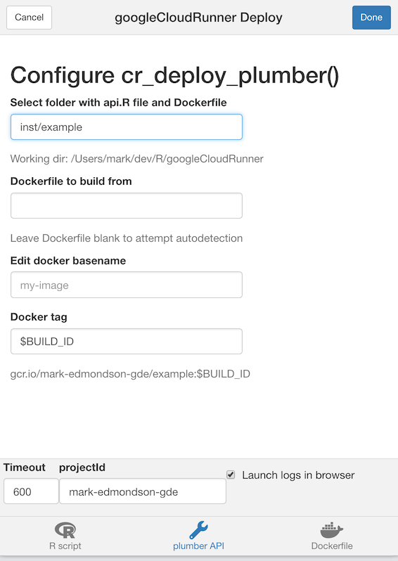

[Cloud Run](https://cloud.run) is a service that lets you deploy container images without worrying about the underlying servers or infrastructure.  It is called with `cr_run()`, or you can automate a deployment via `cr_deploy_run()`.

If you would like to have your R code react in realtime to events such as HTTP or sub/sub events, such as a website or API endpoint, Cloud Run is a good fit.  

If you want to run scripts that can be triggered one time, setup to trigger on GitHub events or pub/sub, or scheduled using Cloud Scheduler then [Cloud Build](https://code.markedmondson.me/googleCloudRunner/articles/cloudbuild.html) is more suited to your use case. 

## Quickstart - plumber API

1. Make an R API via [plumber](https://www.rplumber.io/) that contains entry file api.R.  You can use the demo example in `system.file("example", package="cloudRunner")` if you like.
2. Create a Dockerfile for the API - see bottom of page for how to do this automatically with https://o2r.info/containerit/

The example folder has this Dockerfile:

```
FROM gcr.io/gcer-public/googlecloudrunner:master
COPY ["./", "./"]
ENTRYPOINT ["R", "-e", "pr <- plumber::plumb(commandArgs()[4]); pr$run(host='0.0.0.0', port=as.numeric(Sys.getenv('PORT')))"]
CMD ["api.R"]
```

3. Deploy via the `cr_deploy_plumber()` function:

```r
library(googleCloudRunner)

my_plumber_folder <- system.file("example", package="cloudRunner")
cr <- cr_deploy_plumber(my_plumber_folder)
#2019-11-12 10:34:29 -- File size detected as 903 bytes
#2019-11-12 10:34:31> Cloud Build started - logs: 
#https://console.cloud.google.com/gcr/builds/40343fd4-6981-41c3-98c8-f5973c3de386?project=1080525199262

#Waiting for build to finish:
# |===============||
#Build finished
#2019-11-12 10:35:43> Deployed to Cloud Run at: 
#https://cloudrunnertest2-ewjogewawq-ew.a.run.app
#==CloudRunService==
#name:  cloudrunnertest2 
#location:  europe-west1 
#lastModifier:  1080525199262@cloudbuild.gserviceaccount.com 
#containers:  gcr.io/mark-edmondson-gde/cloudrunnertest2 
#creationTimestamp:  2019-11-12T10:35:19.993128Z 
#observedGeneration:  1 
#url:  https://cloudrunnertest2-ewjogewawq-ew.a.run.app 
```

4. Enjoy your API

### RStudio Gadget - deploy plumber script

If you are using RStudio, installing the library will enable an [RStudio Addin](https://rstudio.github.io/rstudioaddins/) that can be called after you have setup the library as per the setup page. 

It includes a Shiny gadget that you can call via the Addin menu in RStudio, via `googleCloudRunner::cr_deploy_gadget()` or assigned to a hotkey (I use CTRL+SHIFT+D).

This sets up a Shiny UI to help smooth out deployments as pictured:



### What did it do?

Deployment via `cr_deploy_plumber()` automated these steps:

1. Uploads the Dockerfile and your api.R file to your Google Cloud Storage bucket
2. Creates a Cloud Build job for building the files uploaded to the GCS bucket, and pushes the Docker images to Google Container Registry
3. Deploys that container to Cloud Run

It will launch a browser showing the build on Cloud Build, or you can wait for progress in your local R sesion.  Upon successfully deployment it gives you a `CloudRunService` object with details of the deployment. 

All the above stages can be customised for your own purposes, using the functions explained below.

## Customising Cloud Run deployments

The Cloud Run API is not called directly when deploying - instead a Cloud Build is created for deployment. `cr_run` creates a cloudbuild that make a cloud build including `cr_buildstep_run()`.  

You can build the deployment yourself by using `cr_buildstep_run()` within your own `cr_build()`.  This may cover things like downloading encrypted resources necessary for a build, running other code etc.

If you have an existing image you want to deploy on Cloud Run (usually one that serves up HTTP content, such as a website or via `library(plumber)`) then you only need to supply that image to deploy:

```r
cr_run("gcr.io/my-project/my-image")
```

Cloud Run needs [specific ports available in your container](https://cloud.google.com/run/docs/deploying), so you may want to consult the documentation if you do.

However, if you want to do the common use case of building the container first as well, you can do so by using the helper `cr_deploy_docker()`:

```r
cr_deploy_docker("my-image")

cr_run("gcr.io/my-project/my-image")
```

## Cloud Run deployment functions

* `cr_deploy_run()` wraps the steps described above to build the Dockerfile, and deploy it to Cloud Run, setting authentication as needed. 

* `cr_deploy_plumber()` adds checks for plumber API files.  You need to make sure you have an `api.R` file in the deployment folder you provide, that will hold plumber code.

* `cr_deploy_html()` adds steps to deploy a nginx web server ready to serve the HTML files you supply.

## Creating a Dockerfile with containerit

`containerit` is not yet on CRAN so can't be packaged with the CRAN version of `googleCloudRunner` but its a useful package to work with since it auto-creates Dockerfiles from R files.

To install it use `remotes::install_github("o2r-project/containerit")`

[See `containerit`s website for more details](https://o2r.info/containerit/) on how to use it.

An example of using it to help create plumber Dockerfiles is below:

```r
library(containerit)
cr_dockerfile_plumber <- function(deploy_folder, ...){
  docker <- dockerfile(
      deploy_folder,
      image = "trestletech/plumber",
      offline = FALSE,
      cmd = Cmd("api.R"),
      maintainer = NULL,
      copy = list("./"),
      container_workdir = NULL,
      entrypoint = Entrypoint("R",
                       params = list(
        "-e",
       "pr <- plumber::plumb(commandArgs()[4]); pr$run(host='0.0.0.0', port=as.numeric(Sys.getenv('PORT')))")
       ),
      filter_baseimage_pkgs = FALSE,
      ...))

  write_to <- file.path(deploy_folder, "Dockerfile")
  
  write(docker, file = write_to)

  assert_that(
    is.readable(write_to)
  )

  myMessage("Written Dockerfile to ", write_to, level = 3)
  print(docker)
  docker

}
```
