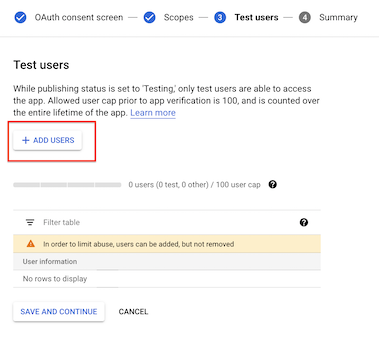

## Setup new Google Cloud Project and client Id

It is recommended to use a new Google Cloud Project, to ensure all modern services are activated.  Billing will need to be enabled with a credit card.

You will need to be logged in as the Owner of the project for the below.

A video walk-through is available below, on [how to set-up googleCloudRunner's Google Console and R environment](https://www.youtube.com/watch?v=RrYrMsoIXsw):

<iframe width="560" height="315" src="https://www.youtube.com/embed/RrYrMsoIXsw" frameborder="0" allow="accelerometer; autoplay; clipboard-write; encrypted-media; gyroscope; picture-in-picture" allowfullscreen></iframe>

### Create Consent Screen for your GCP client

Once your project is created, visit `APIs & Services > Credentials` or `https://console.cloud.google.com/apis/credentials` to set up an OAuth 2.0 Client ID


If not created already, you will first need to make an OAuth consent screen at `APIs & Services > OAuth consent screen` or
`https://console.cloud.google.com/apis/credentials/consent`


For most purposes, you will only need to authorize your own email through this OAuth consent screen, in which case the settings you want will be:

* App name - whatever you want


* Scopes - set them to `../auth/cloud-platform` (**Note in screenshot a Google bug calls all scopes "BigQueryAPI" but should read "Cloud Platform"**)


* Test users = "your@email.com" (plus anyone else who will authenticate with same client ID)



* User type = "External" (or optionally "Internal" if you are a GSuite user)


* Publishing status = "Testing" - you probably do NOT want to push to production otherwise you will need to get approval from Google.


As the app will not be public or in production, the app should not require verification, only test users (e.g. your email) should be approved.  

### Create Oauth2 client ID and download JSON file

Once the consent screen is configured, you should be able to create credentials at `APIs & Services > Credentials > Create Credentials > OAuth client ID` or `https://console.cloud.google.com/apis/credentials/oauthclient`


Select "Desktop app" - an OAuth client should be created.  Download this client ID via the download button on the far right.


Upon creation you will have generated a Client ID and a Client Secret


Now download the client ID JSON file via the download button far-right that will identify your GCP app.  This will be what is used to generated service keys that are another type of JSON file to authenticate users for this app.


Once you have the client Id JSON file, you should be able to use `cr_setup()` or the manual steps below to setup the rest of the configuration.

### Enable APIs

To enable automatic provision of the service accounts are services you may also need to active the APIs necessary

* IAM API `https://console.developers.google.com/apis/api/iam.googleapis.com/overview`
* Cloud Resource Manager `https://console.developers.google.com/apis/api/cloudresourcemanager.googleapis.com/overview`
* Cloud Run `https://console.developers.google.com/apis/api/run.googleapis.com/overview`
* Cloud Build `https://console.cloud.google.com/apis/api/cloudbuild.googleapis.com/overview`

If the APIs are not activated, the error messages should point you in the right direction. Enable the APIs if necessary and try the call again.

You will also need to create a Cloud Schedule job manually first, which will on start up ask you to set up a region for your scheduled jobs. Set them up starting from here: `https://console.cloud.google.com/cloudscheduler`

## Setup wizard cr_setup()

There is a setup function to help you configure the package.  Get started via the commands below:

```r
library(googleCloudRunner)
cr_setup()
#ℹ ==Welcome to googleCloudRunner setup==
#This wizard will scan your system for setup options and help you setup any that are missing.
#Hit 0 or ESC to cancel.
#
#1: Configure/check all googleCloudRunner settings
#2: Configure GCP Project Id
#3: Configure Authentication JSON file
#4: Configure Cloud Storage bucket
#5: Configure Cloud Run region
#6: Configure Cloud Scheduler build email
```

It will walk you through the details below.  You can also use it to check your settings.

### cr_setup_auth() and cr_setup_service()

You can configure authentication separately, as its usually the trickiest bit.  The `cr_setup_auth()` function attempts to help you walk through the authentication and after running it and restarting R a couple of times you should only need to download a client ID from your project to have it all configured for you.

If you are customising things then `cr_setup_service()` may be useful, which lets you add common roles to the service account emails. The other setup functions call it to set things up for you, but you may want more control, or have special needs for your cloud build email for example, which needs roles assigned for certain services you want to build.

### cr_setup_tests()

Once you get all green ticks in `cr_setup()` then you should be able to run the subset of the package unit tests via `cr_setup_test()`.  Should those all complete then you should be able to run any of the functions in the package!

## GCP settings

### Authentication background

The package uses several interacting Google Cloud services so setup needs to cover authentication both for yourself and the services interacting on your behalf.

There are three types of authentication to keep track of:

1. Authenticating your local R session so it can submit jobs
2. Authenticating Cloud Build so it can do the script you have submitted
3. Authenticating services such as Cloud Scheduler so they can trigger builds on your behalf.

Its simplest if you use the same authentication key for 1 and 3, and the default Cloud Build service email for 2. 

Confusion can occur if you use the Cloud Build service email from 2 for 1 or 3.

### Suggested setup

The suggested setup is only required once per GCP project.  Following the below instructions will mean:

1. You can use all R functions in the package to trigger builds locally with a dedicated service key
2. You can reuse the Cloud Build service email to authenticate build services (such as gcloud and BigQuery)
3. Scheduled builds will reuse the key you use locally

Follow these steps:

#### Local auth email

1. Log in to your Google Cloud Project with billing enabled
2. Go to `IAM & Admin > Service accounts`
3. Click "Create Service Account"
4. Create a service account ID - see suggested example here:


5. Set the roles of the service account on the next screen to these:


* Cloud Build Service Account
* Cloud Scheduler Admin
* Service Account User
* Cloud Run Admin
* Storage Object Admin (or Storage Admin to setup pub/sub)

6. Give yourself access as a user to the service account, then click "Create key" and select "JSON"
7. Download the auth json key and put it in a folder separate from all R projects or git commits.  **This file should be guarded as it grants access to sensitive operations**
8. Set your `.Renviron` file to point at the JSON file you just downloaded, and use its service email for scheduled builds e.g.:

```
GCE_AUTH_FILE="/Users/me/auth/auth.json"
CR_BUILD_EMAIL=googlecloudrunner@your-project.iam.gserviceaccount.com
```

9. Ensure you have the Cloud Build, Cloud Run, Cloud Storage and Cloud Scheduler APIs turned on in your GCP project via the `GCP console > APIs & Services`

#### The Cloud Build service account

This is the service account for Cloud Build when it is running on your project.  It is created automatically, and should look like `{project-number}@cloudbuild.gserviceaccount.com` when you examine your IAM console.

* The Cloud Build service account needs permissions if you want it to deploy to Cloud Run: This can be set [here](https://console.cloud.google.com/cloud-build/settings) where you enable `Cloud Run Admin` and `Service Account User` roles.  More details found at this [Google reference article](https://cloud.google.com/cloud-build/docs/deploying-builds/deploy-cloud-run). 
* Ensure you also have a service email in your IAM section called `service-{project-number}@gcp-sa-cloudscheduler.iam.gserviceaccount.com` with Cloud Scheduler Service Agent role.  This is only needed if you created the project before March 2019.  This only needs to exist in the GCP project, it is not used in deployment.  See [here](https://cloud.google.com/scheduler/docs/http-target-auth#add)
* To use `cr_buildstep_secret()` for [Google Secret Manager](https://cloud.google.com/secret-manager) you need the Secret Manager Secret Accessor role assigned to the build service email (`{project-number}@cloudbuild.gserviceaccount.com`).  See [using encrypted secrets and credentials](https://cloud.google.com/cloud-build/docs/securing-builds/use-encrypted-secrets-credentials) Google help page.  If you want to use the decryption service such as from `cr_buildstep_decrypt()` then your Cloud Build service account needs to have at least Cloud KMS CryptoKey Decrypter role.
* Likewise with other GCP services the Cloud Build will use - i.e. if you want to use BigQuery services in your builds, give your build email BigQuery IAM access
* For Cloud Run you need `iam.serviceaccounts.actAs` permission on the `{project-number}-compute@developer.gserviceaccount.com` service email that should be there by default. Similarly, `service-{project-number}@serverless-robot-prod.iam.gserviceaccount.com` should have the role `Cloud Run Service Agent`

#### Misc

* If you want to use GitHub or BitBucket repos, you need to setup mirroring them via Cloud Source Repositories https://source.cloud.google.com/
* To use Cloud Scheduler you may need to initiate an App Engine application https://console.developers.google.com/appengine - you only need to set the region (one allowed per GCP project) and you don't need to create an app

#### Customise?

The above should give you the minimal access required for `googleCloudRunner`. It could be modified to increase the amount of services the local auth file has access to such as Compute Engine VMs etc. (if say you wanted to reuse it for `googleComputeEngineR`)

You could also change the build email set in `CR_BUILD_EMAIL` to be yet another service account, perhaps one with less permissions (such as Cloud Run Invoker, not Cloud Run Admin)
