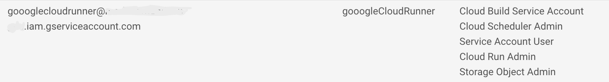

## R Settings

### googleCloudRunner setup wizard cr_setup()

There is a setup function to help you configure the package.  Get started via the commands below:

```r
library(googleCloudRunner)
cr_setup()
#ℹ ==Welcome to googleCloudRunner setup==
#This wizard will scan your system for setup options and help you setup any that are missing.
#Hit 0 or ESC to cancel.
#
#1: Configure/check all googleCloudRunner settings
#2: Configure GCP Project Id
#3: Configure Authentication JSON file
#4: Configure Cloud Storage bucket
#5: Configure Cloud Run region
#6: Configure Cloud Scheduler build email
```

It will walk you through the details below.  You can also use it to check your settings.

### R environment arguments to set:

* Reuses environment argument `GCE_AUTH_FILE` from [googleComputeEngineR](https://cloudyr.github.io/googleComputeEngineR) which holds location of your service auth JSON
* Reuses environment argument `GCE_DEFAULT_PROJECT_ID` from googleComputeEngineR
* Reuses environment argument `GCS_DEFAULT_BUCKET` from [googleCloudStorageR](http://code.markedmondson.me/googleCloudStorageR/)
* New environment argument `CR_REGION` can be one of 

```
"us-central1",
"asia-northeast1",
"europe-west1",
"us-east1"
```
* New environment argument `CR_BUILD_EMAIL` that is a Google service email (see GCP setup)

e.g. your `.Renviron` should look like:

```
GCE_AUTH_FILE="/Users/me/auth/auth.json"
GCE_DEFAULT_PROJECT_ID="my-project"
GCS_DEFAULT_BUCKET="my-bucket"
CR_REGION="europe-west1"
CR_BUILD_EMAIL=googlecloudrunner@your-project.iam.gserviceaccount.com
```

This `.Renviron` file can be placed in the root of your project or as per what is described in `?Startup`.

You can also set the above in the R scripts via:

* `cr_region_set()`
* `cr_project_set()`
* `cr_bucket_set()`
* `cr_email_set()`

Or authenticate via

```r
googleAuthR::gar_service_auth("my_auth_json.com")
```

## GCP settings

### Authentication background

The package uses several interacting Google Cloud services so setup needs to cover authentication both for yourself and the services interacting on your behalf.

There are three types of authentication to keep track of:

1. Authenticating your local R session so it can submit jobs
2. Authenticating Cloud Build so it can do the script you have submitted
3. Authenticating services such as Cloud Scheduler so they can trigger builds on your behalf.

Its simplest if you use the same authentication key for 1 and 3, and the default Cloud Build service email for 2. 

Confusion can occur if you use the Cloud Build service email from 2 for 1 or 3.

### Suggested setup

The suggested setup is only required once per GCP project.  Following the below instructions will mean:

1. You can use all R functions in the package to trigger builds locally with a dedicated service key
2. You can reuse the Cloud Build service email to authenticate build services (such as gcloud and BigQuery)
3. Scheduled builds will reuse the key you use locally

Follow these steps:

#### Local auth email

1. Log in to your Google Cloud Project with billing enabled
2. Go to `IAM & Admin > Service accounts`
3. Click "Create Service Account"
4. Create a service account ID - see suggested example here:


5. Set the roles of the service account on the next screen to these:



* Cloud Build Service Account
* Cloud Scheduler Admin
* Service Account User
* Cloud Run Admin
* Storage Object Admin (or Storage Admin to setup pub/sub)

6. Give yourself access as a user to the service account, then click "Create key" and select "JSON"
7. Download the auth json key and put it in a folder separate from all R projects or git commits.  **This file should be guarded as it grants access to sensitive operations**
8. Set your `.Renviron` file to point at the JSON file you just downloaded, and use its service email for scheduled builds e.g.:

```
GCE_AUTH_FILE="/Users/me/auth/auth.json"
CR_BUILD_EMAIL=googlecloudrunner@your-project.iam.gserviceaccount.com
```

9. Ensure you have the Cloud Build, Cloud Run, Cloud Storage and Cloud Scheduler APIs turned on in your GCP project via the `GCP console > APIs & Services`

#### The Cloud Build service account

This is the service account for Cloud Build when it is running on your project.  It is created automatically, and should look like `{project-number}@cloudbuild.gserviceaccount.com` when you examine your IAM console.

* The Cloud Build service account needs permissions if you want it to deploy to Cloud Run: This can be set [here](https://console.cloud.google.com/cloud-build/settings) where you enable `Cloud Run Admin` and `Service Account User` roles.  More details found at this [Google reference article](https://cloud.google.com/cloud-build/docs/deploying-builds/deploy-cloud-run). 
* Ensure you also have a service email in your IAM section called `service-{project-number}@gcp-sa-cloudscheduler.iam.gserviceaccount.com` with Cloud Scheduler Service Agent role.  This is only needed if you created the project before March 2019.  This only needs to exist in the GCP project, it is not used in deployment.  See [here](https://cloud.google.com/scheduler/docs/http-target-auth#add)
* To use `cr_buildstep_secret()` for [Google Secret Manager](https://cloud.google.com/secret-manager) you need the Secret Manager Secret Accessor role assigned to the build service email (`{project-number}@cloudbuild.gserviceaccount.com`).  See [using encryupted secrets and credentials](https://cloud.google.com/cloud-build/docs/securing-builds/use-encrypted-secrets-credentials) Google help page.  If you want to use the decryption service such as from `cr_buildstep_decrypt()` then your Cloud Build service account needs to have at least Cloud KMS CryptoKey Decrypter role.
* Likewise with other GCP services the Cloud Build will use - i.e. if you want to use BigQuery services in your builds, give your build email BigQuery IAM access

#### Misc

* If you want to use GitHub or BitBucket repos, you need to setup mirroring them via Cloud Source Repositories https://source.cloud.google.com/
* To use Cloud Scheduler you may need to initiate an App Engine application https://console.developers.google.com/appengine - you only need to set the region (one allowed per GCP project) and you don't need to create an app

#### Customise?

The above should give you the minimal access required for `googleCloudRunner`. It could be modified to increase the amount of services the local auth file has access to such as Compute Engine VMs etc. (if say you wanted to reuse it for `googleComputeEngineR`)

You could also change the build email set in `CR_BUILD_EMAIL` to be yet another service account, perhaps one with less permissions (such as Cloud Run Invoker, not Cloud Run Admin)
