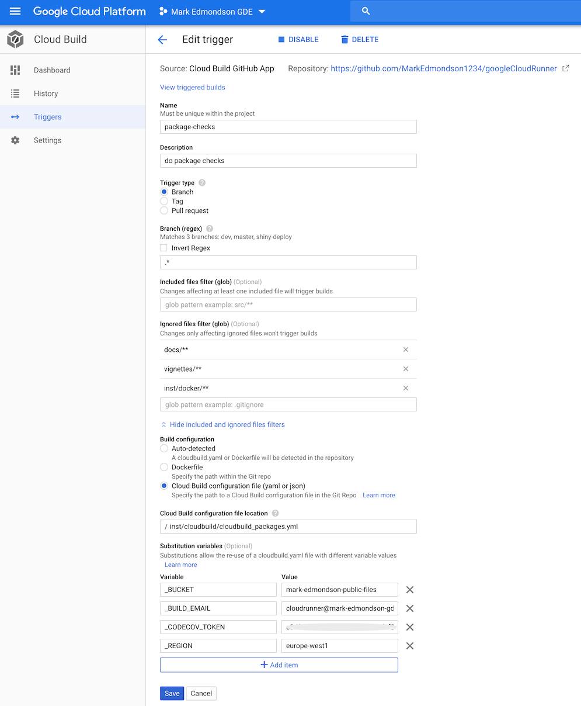

Here will be some example use cases you can use googleCloudRunner for.

Since almost any code can be called and passed via Docker images, there are a lot of potential uses.

* Scheduling R scripts in the cloud
* R APIs to call from anywhere
* Triggering R code to run on events, such as BigQuery table updates or GitHub pushes
* Checking a package, creating a website, deploying it to GitHub
* Running authenticated tests for R packages in private environment
* Creating an Rmarkdown powered website using Cloud Run
* Integrating R with other language applications
* Public and private Docker image creations on triggers

Some [community contributed Cloud Build images are listed here](https://github.com/GoogleCloudPlatform/cloud-builders-community), including [hugo](https://github.com/GoogleCloudPlatform/cloud-builders-community/tree/master/hugo), [make](https://github.com/GoogleCloudPlatform/cloud-builders-community/tree/master/make), and [tar](https://github.com/GoogleCloudPlatform/cloud-builders-community/tree/master/tar).

You can use any public Docker image if you know which arguments etc. to send to it, for example the Slack messages are using [`technosophos/slack-notify`](https://github.com/technosophos/slack-notify).

## Deploy a pkgdown website for your R package

When creating an R package [pkgdown](https://pkgdown.r-lib.org/) is a fantastic resource for creating a package website from your R function's documentation and vignettes.  

This workflow uses Google's Secret Manager to securely hold your Git ssh login details, then use those details to commit a built website on each Git commit.  This means you do not have to build the website locally.

Each commit you make, a background task will build the website with your changes and commit it back to the repo - see example for this website:


A suggested setup workflow to do this is below:

1. Go to [GCP console > Cloud Build > Triggers](https://console.cloud.google.com/cloud-build/triggers) and link your git repo to Cloud Build.
2. Create a git ssh key to make commits to your repo.  [GitHub has a guide here](https://help.github.com/en/github/authenticating-to-github/generating-a-new-ssh-key-and-adding-it-to-the-ssh-agent)
3. Upload the ssh key secret to [Google Cloud Secret Manager](https://cloud.google.com/secret-manager) - you can use this secret for all future builds.
4. Use `cr_deploy_pkgdown()` to create a cloudbuild.yml file in your R package's directory, giving it your secret name from step 2.  `create_trigger` can be `file` if you want the cloudbuild.yaml to be within your directory, or `inline` if the build will only be defined in the trigger.

```r
cr_deploy_pkgdown("MarkEdmondson1234/googleCloudRunner",
                  secret = "github-key",
                  create_trigger = "inline")
```

5. Commit to your git repository

The function will then create a build customised for creating and rendering pkgdown websites, and committing the rendered version to your GitHub /docs folder.

The below is an example for `googleCloudRunner`'s website:


You can customise the deployment further by using `cr_buildstep_pkgdown()` in your own custom build files. For instance, you could download other auth keys using `cr_buildstep_secret()` again, so that your website has working authenticated examples. 

## Run package tests and code coverage

This workflow will run the package tests you have upon each commit to your git repo.  

You can also optionally submit those test results to [codecov](https://codecov.io) via the excellent [covr R package](https://covr.r-lib.org/), helping you see which code your tests actually test. This is what creates this badge for this package:

[](https://codecov.io/gh/MarkEdmondson1234/googleCloudRunner)

If you do not need online authentication for your tests, then this is only a case of deploying the premade default cloudbuild.yml file via `cr_deploy_packagetests()`.

The below assumes you have created tests for your package.

1. If you want to use Codecov, [generate a Codecov token](https://docs.codecov.io/reference) on its website and link it to your git repository
2. Create the tests cloudbuild.yml file via `cr_deploy_packagetests()`
3. Add and commit the cloudbuild.yml file to your git repository
4. Go to [GCP console > Cloud Build > Triggers](https://console.cloud.google.com/cloud-build/triggers) and link your git repo to Cloud Build.
5. Create a Build Trigger for your git repository: 

* point at the cloudbuild.yml file you committed (e.g. cloudbuild-tests.yml)
* Exclude any folders such as the `docs/**` folder where changes should not trigger a recheck
* Add a substitution variable `_CODECOV_TOKEN` if you are using it

The below is an example for `googleCloudRunner`'s website:



The example above also adds other substitution variables to help run some of the examples. 

### Authenticated tests

You can customise the deployment more by using `cr_buildstep_packagetests()` in your own custom build files. 

For `googleCloudRunner` and API packages in general, an authentication key is needed to run online tests.  This authentication key can be encrypted via [Google Secret Manager](https://cloud.google.com/secret-manager) by adding a decryption step to your tests via `cr_buildstep_secret()` - its usually only a case of uploading your auth file:


In that case, the decryption step needs to occur before the tests run, which you can do by supplying `cr_buildstep_secret()` to `cr_deploy_packagetests()`.  

You will also want to use that auth file somehow, in the below example it is placed in an environment argument that your tests use to find the authentication file:

```r
cr_deploy_packagetests(
  steps = cr_buildstep_secret("my_secret", "auth.json"),
  env = c("NOT_CRAN=true", "MY_AUTH_FILE=auth.json")
)
```

Use the resulting cloudbuild.yml file in the same manner as unauthenticated tests. 

## Run R code on a schedule

Sometimes you just want to have some R code running whilst you get on with something else.  In this case you can use `cr_buildstep_r()` to run your R code even after you have turned your computer off, since its running in the cloud.  You can also set it up on a schedule to run periodically.

When running R code, it needs to run in an environment that has the packages and resources it needs.  If those are covered by images such as `rocker/verse` (the tidyverse) then you can commit it straight away.  Otherwise you can first make a custom Docker file with the R packages you need in it, and then run your code against that. 

Once you have your R code and chosen the Docker image, then you can use `cr_deploy_r()` to point at your R file and Docker image, set the timeout to what you need (the maximum is 24 hours) and select a schedule if you need it. 

An RStudio gadget is also available to help you deploy:


If you want help creating the Docker image, try [`containerit`](https://o2r.info/containerit/) to generate your Dockerfile, then use `cr_deploy_docker()` to build it.

### Execute R scripts directly from Cloud Storage

In some cases you may hit character limits of the cloudbuild file in which case you will need to execute the R code from a file.  The easiest way to do this is to upload your R code to a Cloud Storage bucket and then supply the `gs://` URI to `cr_buildstep_r()`:

The below example uses a public bucket and R image, for your use case you would change to your own private one that your Cloud Build service email has access to:

```r
library(googleCloudRunner)

large_r_job <- cr_build_yaml(
  steps = c(
    cr_buildstep_r("gs://mark-edmondson-public-read/schedule.R", 
                   name = "gcr.io/gcer-public/googleauthr-verse:latest")
  )
)
cr_build(large_r_job)
```


### Authentication within the R script on Cloud Build

The recommended way to use secrets in build is to use `cr_buildstep_secret()`, and upload the sensitive authentication file to [Google Secret Manager](https://cloud.google.com/secret-manager) before hand.

You can also authenticate without uploading any file, if you can use the default service account.  This is usually the case for cloud services such as BigQuery.

The default metadata of the Cloud Build server is the same as `googleComputeEngineR`, so you can use `googleAuthR::gar_gce_auth("default", scopes = "https://www.googleapis.com/auth/cloud-platform")`.  

You can also use the Cloud Build email (the one that looks like `{project-number@cloudbuild.gserviceaccount.com}`) if its given the right access in Cloud IAM, authentication in your R script will look like `googleAuthR::gar_gce_auth("{project-number@cloudbuild.gserviceaccount.com}", scopes = "https://www.googleapis.com/auth/cloud-platform")`

This enables you in the R script to download files from Cloud Storage, for example.  A minimal example is shown below:

```r
library(googleCloudStorageR)
library(googleAuthR)
gar_gce_auth("default", scopes = "https://www.googleapis.com/auth/cloud-platform")

## or if using the build email..
# gar_gce_auth("{project-number@cloudbuild.gserviceaccount.com}", 
#                scopes = "https://www.googleapis.com/auth/cloud-platform")

gcs_list_buckets("my_project")
auth_file <- gcs_get_object("config.json", bucket = "my-bucket")

...do something with the config file...
```

This would then be saved to an R script and deployed via the gadget or:

```r
cr_deploy_r("the_script.R", r_image = "gcr.io/gcer-public/googleauthr-verse")
```

...where the docker R image is one with googleCloudStorageR installed.

## Create Docker image of a package each commit

If you just want a one-off Docker image, use `cr_deploy_docker()` or make your own build via `cr_buildstep_docker()`


If you want the Docker image to rebuild each git commit, then you also need a build trigger.  This can be enabled using `cr_deploy_docker_trigger()`

The below example builds this package's Dockerfile upon each commit, for a Dockerfile located in the `cloud_build/` folder.

```r
repo <- cr_buildtrigger_repo("MarkEdmondson1234/googleCloudRunner")
cr_deploy_docker_trigger(repo, "test3", dir = "cloud_build")
```

### Kaniko cache

A common workflow is to make lots of repeat builds of Docker images as you update the files and libraries within the Dockerfile.  If this is a heavy operation it can take 20mins+ to build the image.

If it is a long build, consider using the [kaniko cache](https://cloud.google.com/cloud-build/docs/kaniko-cache) option in your Docker builds.  This caches each step of the Dockerfile so only those that are new are built, and can considerably speed up Docker build times. 

To use, select the `kamiko_cache=TRUE` option in your builds:

```r
cr_deploy_docker("my_folder", kaniko_cache=TRUE)
```

## Migrate an existing scheduled Docker container 

You may have an existing Docker container containing code, that doesn't need a public URL.  

For example, a self-contained R script with `googleAnalyticsR` and `bigQueryR` pre-installed, that downloads data from Google Analytics and uploads it to BigQuery.  This may be running on a VM from `googleComputeEngineR`, Kubernetes or Airflow KubernetesPodOperator.  

If you give the cloud build service email the right permissions, then this can all be done on Cloud Build + Cloud Scheduler.

For example, say your existing container is called `gcr.io/my-project/my-r-script`.  A Cloud Build could look simply like this:

```r
r_code <- cr_build_yaml(
  cr_buildstep("gcr.io/my-project/my-r-script")
)
cr_build(r_code)
```

You could add other steps if you wanted, such as sending an email when done via `cr_buildstep_mailgun()` or `cr_buildstep_slack()`:

```r
r_code <- cr_build_yaml(
  cr_buildstep("gcr.io/my-project/my-r-script"),
  cr_buildstep_slack("The script run ok")
)
cr_build(r_code, `_SLACK_WEBHOOK` = "https://your_slack_webhook")

```

To set this up in a schedule, add it to the scheduler like so:

```r
built <- cr_build(r_code, `_SLACK_WEBHOOK` = "https://your_slack_webhook")
schedule_me <- cr_build_schedule_http(built)
cr_schedule("r-code-example", "15 8 * * *", httpTarget = schedule_me)
```

## Deploying Shiny to Cloud Run

Due to Shiny's stateful nature, Cloud Run is not a perfect fit for Shiny but it can be configured to run Shiny apps that scale to 0 (e.g. no cost) up to 80 connections at once to one instance.  The one instance is necessary to avoid requests being sent to another Shiny container instance and losing the user session.  Shiny also needs to have certain websocket features disabled.

This means you can't scale to a billion like other Cloud Run apps, and need to keep an eye on the load of the Shiny app (which will depend on your code) to see if 80 connections are too much for the CPU and Memory you assign to the Cloud Run instance.  However this should still be a good fit for a lot of data science applications.


A minimal working example has been created by @randy3k here: https://github.com/randy3k/shiny-cloudrun-demo which can be deployed to Cloud Run via a fork here:

```r
library(googleCloudRunner)

# a repo with the Dockerfile template
repo <- cr_buildtrigger_repo("MarkEdmondson1234/shiny-cloudrun-demo")

# deploy a cloud build trigger so each commit build the image
cr_deploy_docker_trigger(
  repo,
  image = "shiny-cloudrun"
)

# deploy to Cloud Run
cr_run(sprintf("gcr.io/%s/shiny-cloudrun:latest",cr_project_get()),
       name = "shiny-cloudrun",
       concurrency = 80,
       max_instances = 1)
```

If you need to change the memory for the one instance, you can use `cpu` and `memory` arguments in the `cr_buildstep_run()` and subsequent functions such as `cr_run()`.  The maximum allowed is 2 CPUs and 2 gibibytes (`2Gi`):

```r
# deploy to Cloud Run with 2GBs of RAM per instance and 2 CPUs
cr_run(sprintf("gcr.io/%s/shiny-cloudrun:latest",cr_project_get()),
       name = "shiny-cloudrun",
       concurrency = 80,
       max_instances = 1,
       cpu = 2,
       memory = "2Gi")
```

Or if you have a local Shiny app in `shiny_cloudrun/` with the appropriate Dockerfile and Shiny configuration, the full Docker build and deployment pipeline can be carried out with:

```r
# deploy the app version from this folder
cr_deploy_run("shiny_cloudrun/",
              remote = "shiny-cloudrun2",
              tag = c("latest","$BUILD_ID"),
              max_instances = 1, # required for shiny
              concurrency = 80)
```

## Run private R micro-services on Cloud Run

One strategy for running lots of parallel computation is to use an API endpoint, which can be triggered many times simultaneously.

Hosting the computation behind a plumber API and hosted on Cloud Run, you can control what data is worked on via URL parameters, and loop calling the API.

The R computation behind plumber could call other services or compute directly, although keep in mind the 15min timeout for Cloud Run API responses.

A demonstration is shown below:

### Creating the Cloud Run deployment

The demo API queries a BigQuery database and computes a forecast for the time-series it gets back.  The data is from the Covid public datasets hosted on BigQuery.

The plumber script below has two endpoints:

* `/` to test its running
* `/covid_traffic` which is fetched with parameters region and industry to specify what times-series to fetch a forecast for. 

We will want these to be private (e.g. only authenticated calls) since they contain potentially expensive BigQuery queries. 
 
#### plumber API script

```r
if(Sys.getenv("PORT") == "") Sys.setenv(PORT = 8000)

#auth via BQ_AUTH_FILE environment argument
library(bigQueryR)
library(xts)
library(forecast)

#' @get /
#' @html
function(){
  "<html><h1>It works!</h1></html>"
}


#' @get /covid_traffic
#' @param industry the industry to filter results down to e.g "Software"
#' @param region the region to filter results down to e.g "Europe"
function(region=NULL, industry=NULL){

  if(any(is.null(region), is.null(industry))){
    stop("Must supply region and industry parameters")
  }

  # to handle spaces
  region <- URLdecode(region)
  industry <- URLdecode(industry)

  sql <- sprintf("SELECT date, industry, percent_of_baseline FROM `bigquery-public-data.covid19_geotab_mobility_impact.commercial_traffic_by_industry`  WHERE region = '%s' order by date LIMIT 1000", region)

  message("Query: ", sql)

  traffic <- bqr_query(
    query = sql,
    datasetId = "covid19_geotab_mobility_impact",
    useLegacySql = FALSE,
    maxResults = 10000
  )

  # filter to industry in R this time
  test_data <- traffic[traffic$industry == industry,
                       c("date","percent_of_baseline")]

  tts <- xts(test_data$percent_of_baseline,
             order.by = test_data$date,
             frequency = 7)

  # replace with long running sophisticated analysis
  model <- forecast(auto.arima(tts))

  # output a list that can be turned into JSON via jsonlite::toJSON
  o <- list(
    params = c(region, industry),
    x = model$x,
    mean = model$mean,
    lower = model$lower,
    upper = model$upper
  )

  message("Return: ", jsonlite::toJSON(o))
  
  o

}
```

#### Deploy plumber API as a private micro-service

The first step is to host the plumber API above.

The steps below:

* Download an authentication file for the script
* Build the Docker container for the plumber API
* Deploys the plumber API to a private Cloud Run instance
* Creates the cloudbuild.yml and writes it to a file in the repo

```r
library(googleCloudRunner)

bs <- c(
  cr_buildstep_secret("my-auth",
      decrypted = "inst/docker/parallel_cloudrun/plumber/auth.json"),
  cr_buildstep_docker("cloudrun_parallel",
                      dir = "inst/docker/parallel_cloudrun/plumber",
                      kaniko_cache = TRUE),
  cr_buildstep_run("parallel-cloudrun",
                   image = "gcr.io/$PROJECT_ID/cloudrun_parallel:$BUILD_ID",
                   allowUnauthenticated = FALSE,
                   env_vars = "BQ_AUTH_FILE=auth.json,BQ_DEFAULT_PROJECT_ID=$PROJECT_ID")
)

# make a buildtrigger pointing at above steps
cloudbuild_file <- "inst/docker/parallel_cloudrun/cloudbuild.yml"
by <- cr_build_yaml(bs)
cr_build_write(by, file = cloudbuild_file)
```

#### Create a build trigger so it builds upon each git commit

Now the cloudbuild.yml is available, a build trigger is created so that it will deploy upon each commit to this GitHub:

```r
repo <- cr_buildtrigger_repo("MarkEdmondson1234/googleCloudRunner")
cr_buildtrigger(cloudbuild_file,
                "parallel-cloudrun",
                trigger = repo,
                includedFiles = "inst/docker/parallel_cloudrun/**")
```

The files are then committed to GitHub and the build reviewed in the GCP Console. 

Once the builds are done, you should have a plumber API deployed with a URL similar to 
`https://parallel-cloudrun-ewjogewawq-ew.a.run.app/`

### Calling the private plumber API with a JWT

Now the plumber API is up, but to call it with authentication will need a JSON Web Token, or JWT.  These are supported via the `cr_jwt_create()` functions:

```r
cr <- cr_run_get("parallel-cloudrun")

# Interact with the authenticated Cloud Run service
the_url <- cr$status$url
jwt <- cr_jwt_create(the_url)

# needs to be recreated every 60mins
token <- cr_jwt_token(jwt, the_url)

# call Cloud Run with token using httr call
library(httr)
res <- cr_jwt_with_httr(
  GET("https://parallel-cloudrun-ewjogewawq-ew.a.run.app/"),
  token)
content(res)
```

The JWT token needs renewing each hour.

#### Use your private micro-service

The above shows you can call the API's test endpoint, but now we wish to call the API many times with the parameters to filter to the data we want.

This is facilitated by a wrapper function to call our API:

```r
# interact with the API we made
call_api <- function(region, industry, token){
  api <- sprintf(
    "https://parallel-cloudrun-ewjogewawq-ew.a.run.app/covid_traffic?region=%s&industry=%s",
    URLencode(region), URLencode(industry))

  message("Request: ", api)
  res <- cr_jwt_with_httr(httr::GET(api),token)

  httr::content(res, as = "text", encoding = "UTF-8")

}

# test call
result <- call_api(region = "Europe", industry = "Software", token = token)
```

Once the test call is complete, you can loop over your data - the parameters for this particular dataset are shown below:

```r
# the variables to loop over
regions <- c("North America", "Europe","South America","Australia")
industry <- c("Transportation (non-freight)",
              "Software",
              "Telecommunications",
              "Manufacturing",
              "Real Estate",
              "Government",
              "Construction",
              "Holding Companies & Conglomerates",
              "Freight & Logistics Services",
              "Agriculture",
              "Retail",
              "Consumer Services",
              "Hospitality",
              "Business Services",
              "Waste Treatment, Environmental Services & Recycling",
              "Energy & Utilities",
              "Education",
              "Insurance",
              "Media & Internet",
              "Minerals & Mining",
              "Healthcare Services & Hospitals",
              "Organizations",
              "Finance")
```

#### Parallel calling of the API

For parallel processing, ideally you don't want R to block waiting for the HTTP response for each URL you are sending.  This is easiest achieved through using [`curl`](https://jeroen.cran.dev/curl) and its [`curl_fetch_multi()`](https://cran.r-project.org/web/packages/curl/vignettes/intro.html#async_requests) function.

A helper function that takes care of adding multiple URLs to the same curl pool is `cr_jwt_with_curl()` - if you pass it a vector of URL strings to call and the token, it will attempt to call all of them at the same time.

An example calling each possible combination of the industries/regions above is shown below, which utilises `expand.grid()` to create the URL variations.

```r
## curl multi asynch

# function to make the URLs
make_urls <- function(regions, industry){

  combos <- expand.grid(regions, industry, stringsAsFactors = FALSE)

  unlist(mapply(function(x,y){sprintf("https://parallel-cloudrun-ewjogewawq-ew.a.run.app/covid_traffic?region=%s&industry=%s",URLencode(x), URLencode(y))},
                SIMPLIFY = FALSE, USE.NAMES = FALSE,
         combos$Var1 ,combos$Var2))
}

# make all the URLs
all_urls <- make_urls(regions = regions, industry = industry)

# calling them
cr_jwt_async(all_urls, token = token)
```

Some example output is shown below - not that some combinations didn't have data so the API returned a 500 error, but later valid combinations completed and returned the JSON response for the forecast:

```
> # calling them
> cr_jwt_async(all_urls, token = token)
ℹ 2020-09-20 21:58:06 > Calling asynch:  https://parallel-cloudrun-ewjogewawq-ew.a.run.app/covid_traffic?region=North%20America&industry=Transportation%20(non-freight)
ℹ 2020-09-20 21:58:06 > Calling asynch:  https://parallel-cloudrun-ewjogewawq-ew.a.run.app/covid_traffic?region=Europe&industry=Transportation%20(non-freight)
ℹ 2020-09-20 21:58:06 > Calling asynch:  https://parallel-cloudrun-ewjogewawq-ew.a.run.app/covid_traffic?region=South%20America&industry=Transportation%20(non-freight)
ℹ 2020-09-20 21:58:06 > Calling asynch:  https://parallel-cloudrun-ewjogewawq-ew.a.run.app/covid_traffic?region=Australia&industry=Transportation%20(non-freight)
ℹ 2020-09-20 21:58:06 > Calling asynch:  https://parallel-cloudrun-ewjogewawq-ew.a.run.app/covid_traffic?region=North%20America&industry=Software
ℹ 2020-09-20 21:58:13 > 500 failure for request https://parallel-cloudrun-ewjogewawq-ew.a.run.app/covid_traffic?region=North%20America&industry=Software
ℹ 2020-09-20 21:58:13 > 500 failure for request https://parallel-cloudrun-ewjogewawq-ew.a.run.app/covid_traffic?region=Australia&industry=Transportation%20(non-freight)
[[1]]
[1] "{\"params\":[\"North America\",\"Transportation (non-freight)\"],\"x\":[100,99,108,104,105,104,105,102,102,108,104,105,104,105,99,98,59,78,78,78,78,100,100,108,106,105,105,105,100,103,109,104,104,105,106,103,102,108,104,104,103,100,96,97,67,64,62,60,59],\"mean\":[64.031,68.3173,71.9691,75.0803,77.731,79.9894,81.9135,83.5527,84.9493,86.1392],\"lower\":[[52.8354,46.9089],[53.6094,45.8236],[55.1655,46.2703],[56.9063,47.2856],[58.6237,48.5089],[60.2322,49.7734],[61.6977,50.9961],[63.0104,52.136],[64.1733,53.1751],[65.1951,54.108]],\"upper\":[[75.2265,81.1531],[83.0251,90.8109],[88.7726,97.6679],[93.2543,102.8751],[96.8384,106.9531],[99.7466,110.2054],[102.1292,112.8308],[104.095,114.9694],[105.7254,116.7235],[107.0833,118.1704]]}"

[[2]]
[1] "{\"params\":[\"South America\",\"Transportation (non-freight)\"],\"x\":[14,13,12,9,13,17,19,15,11,14,15,16,16,14,11,15,19,18,16,16,12,18,21,18,18,12,18,19,18,19,16,15,17,20,21,20,18,24,26,25,18,22,19,17,21,24,20,19,19,23,27,27,24,22,17,24,26,24,20,18,21,24,23,20,26,19,20,17,21,26,23,19,17,27,23,20,21,22,17,26,23,20,18,21,19,18,28,22,18,24,15,21,27,21,21],\"mean\":[19.7145,21.4333,23.6604,24.1475,22.5433,20.6944,20.6384,22.468,24.3021,24.3207],\"lower\":[[15.9943,14.0249],[17.6591,15.6611],[19.8826,17.8828],[20.3669,18.3656],[18.7179,16.6929],[16.7392,14.6454],[16.566,14.4103],[18.3612,16.1872],[20.1922,18.0166],[20.2036,18.0241]],\"upper\":[[23.4346,25.404],[25.2075,27.2054],[27.4381,29.438],[27.928,29.9293],[26.3686,28.3936],[24.6495,26.7433],[24.7107,26.8665],[26.5747,28.7487],[28.412,30.5876],[28.4378,30.6173]]}"

[[3]]
[1] "{\"params\":[\"Europe\",\"Transportation (non-freight)\"],\"x\":[40,52,55,50,52,44,59,55,54,60,63,43,54,49,46,38,64,55,53,51,58,61,42,43,40,54,53,60,63,54,44,43,52,38,53,51,47,53,58,44,54,62,56,59,63,48,62,66,60,68,73,69,71,77,77,63,66],\"mean\":[68.5688,68.5688,68.5688,68.5688,68.5688,68.5688,68.5688,68.5688,68.5688,68.5688],\"lower\":[[58.5753,53.2851],[58.1036,52.5637],[57.6523,51.8735],[57.2189,51.2107],[56.8015,50.5723],[56.3984,49.9558],[56.0082,49.359],[55.6297,48.7802],[55.2621,48.2179],[54.9043,47.6707]],\"upper\":[[78.5622,83.8525],[79.0339,84.5738],[79.4852,85.2641],[79.9186,85.9269],[80.3361,86.5653],[80.7392,87.1818],[81.1294,87.7786],[81.5078,88.3573],[81.8755,88.9196],[82.2333,89.4668]]}"
```


## Trigger an R function from pub/sub

This uses `cr_deploy_plumber` to deploy an R API that can then be triggered from pub/sub events, such as Cloud logging events or when files get updated in a Cloud Storage bucket.  This in turn can trigger other Cloud Builds. 

A plumber API that accepts pub/sub messages is facilitated by `cr_plumber_pubsub()`

`api.R`:

```r
# example function echos back pubsub message
# change to do something more interesting with event data
pub <- function(x){
  paste("Echo:", x)
}

#' Receive pub/sub message
#' @post /pubsub
#' @param message a pub/sub message
function(message=NULL){
  googleCloudRunner::cr_plumber_pubsub(message, pub)
}
```

Deploy the R API using an image that has plumber and googleCloudRunner installed.  There is one available at `gcr.io/gcer-public/googlecloudrunner`

`Dockerfile`:

```
FROM gcr.io/gcer-public/googlecloudrunner:master

COPY [".", "./"]

ENTRYPOINT ["R", "-e", "pr <- plumber::plumb(commandArgs()[4]); pr$run(host='0.0.0.0', port=as.numeric(Sys.getenv('PORT')))"]
CMD ["api.R"]
```

Put both the Dockerfile and the `api.R` script in the same folder then deploy it to Cloud Run:

```r
cr_deploy_plumber("the_folder")
```

Or use the RStudio gadget:


Once built you will have a pub/sub live that will trigger the function you defined.  You can test pubsub messages via `cr_pubsub()`

```r
test_url <- "http://your-cloudrun-api.com/pubsub"

cr_pubsub(test_url, "hello")
# [1] "Echo: hello"
```

In this case the function only echos, but you can modify the function to call other libraries, functions, operate on data sent in pubsub such as bucket object names, BigQuery tableIds, etc.

```r
# perhaps the function calls another Cloud Build
pub <- function(x){
  cr_build(x, source = my_source)
}
```

If you would like to trigger a pub/sub message when a file arrives on Google Cloud Storage, use `googleCloudStorageR::gcs_create_pubsub()` 

## Deploy a Shiny app to Google Kubernetes Engine

If you have a Shiny app and a Google Kubernetes Engine (GKE) instance you can automate deployment of that app upon each git commit.

Each commit the buildsteps need to re-build the Docker container with the Shiny app code and environment, then deploy it to the GKE instance.

### Dockerfile

Assuming you have a shiny app in `./shiny/` relative to the Dockerfile, then a Dockerfile could look like:

```
FROM rocker/shiny

# install R package dependencies
RUN apt-get update && apt-get install -y \
    libssl-dev \
    ## clean up
    && apt-get clean \
    && rm -rf /var/lib/apt/lists/ \
    && rm -rf /tmp/downloaded_packages/ /tmp/*.rds

## Install packages from CRAN
RUN install2.r --error \
    -r 'http://cran.rstudio.com' \
        remotes \
        shinyjs \
    ## install Github packages
    && installGithub.r MarkEdmondson1234/googleCloudRunner \
    ## clean up
    && rm -rf /tmp/downloaded_packages/ /tmp/*.rds

## assume shiny app is in build folder /shiny
COPY ./shiny/ /srv/shiny-server/my-app/
```

Depending on how your ingress is setup, this would appear on your Kubernetes cluster at `/my-app/` - see this blog post on details for [setting up R on Kubernetes](https://code.markedmondson.me/r-on-kubernetes-serverless-shiny-r-apis-and-scheduled-scripts/)

### Kubernetes deployment file

You can then also have a deployment file for Kubernetes that will govern its configuration after the new docker image is built.  An example deployment file is below:

```yaml
apiVersion: extensions/v1beta1
kind: Deployment
metadata:
  name: shiny-your-app
spec:
  replicas: 1
  selector:
    matchLabels:
      run: shiny-your-app
  strategy:
    rollingUpdate:
      maxSurge: 1
      maxUnavailable: 1
    type: RollingUpdate
  template:
    metadata:
      labels:
        run: shiny-your-app
    spec:
      nodeSelector:
        cloud.google.com/gke-nodepool: generic-compute-pool
      volumes:
      - name: varlog
        emptyDir:
      containers:
      - name: shiny-your-app
        image: gcr.io/your-project/shiny-your-app:latest
        ports:
        - containerPort: 3838
        volumeMounts:
        - name: varlog
          mountPath: /var/log/shiny-server/
```

### Cloud Build

Your cloudbuild steps will then build the Dockerfile, then use `gcr.io/cloud-builders/gke-deploy` to deploy it to the cluster - see this [Google guide on deployment to GKE via Cloud Build](https://cloud.google.com/cloud-build/docs/deploying-builds/deploy-gke) for details

```r
library(googleCloudRunner)

bs <- c(
  cr_buildstep_docker("shiny-your-app",
                      tag = c("latest","$SHORT_SHA"),
                      kaniko_cache = TRUE),
  cr_buildstep("gke-deploy",
               args = c("run",
                        "--filename=deployment-k8s.yml",
                        "--image=gcr.io/$PROJECT_ID/shiny-your-app:$SHORT_SHA",
                        "--location=europe-west1-b",
                        "--cluster=your-k8s-cluster"))
)

yaml <- cr_build_yaml(steps = bs)
cr_build_write(yaml, "build/cloudbuild.yml")
```

In this example we write the cloudbuild.yml to a build folder rather than making an inline build trigger deployment.  This is setup in a Build Trigger upon GitHub commit with the code below:

```r
repo <- cr_buildtrigger_repo("your-name/your-repo-with-shiny")

# test build by pushing to git after this trigger made
cr_buildtrigger("build/cloudbuild.yml",
                name = "deploy-my-shiny-app",
                trigger = repo)

```

All together the git repo folder looks like:

```
|
|- build/
   | - cloudbuild.yml
|- deployment-k8s.yml
|- Dockerfile
|- shiny/
   | - app.R
```
 
As you update the code in `app.R` and push to GitHub, the build trigger builds the Docker image and publishes it to the kubernetes cluster.  The docker is built using kaniko cache, which speeds up repeat builds and deployments.


## Run R code when a pub/sub message is created from a new file in Google Cloud Storage

This is a demo to show how to make use of [Pub/Sub messages](https://cloud.google.com/pubsub/docs/overview).  Pub/Sub messages are used throughout the Google Cloud Platform, for this example we will use one for when a new object is created in a Google Cloud Storage bucket.

A video walkthrough of the below is available [here](https://www.youtube.com/watch?v=MoKHsFr1B88)

<iframe width="560" height="315" src="https://www.youtube.com/embed/MoKHsFr1B88" frameborder="0" allow="accelerometer; autoplay; encrypted-media; gyroscope; picture-in-picture" allowfullscreen></iframe>

### The plumber API with pub/sub

The API endpoint in plumber needs an endpoint to recieve Pub/Sub messages, then an R function to process and do what you want with that message.  In this case we shall email the file name to an end user.  This could be expanded to do some R analysis, or what ever you need.

```r
#' Send an email via mailgun
send_email <- function(message){
  message("sending email with message: ", message)

  httr::POST(paste0(Sys.getenv("MAILGUN_URL"),"/messages"),
             httr::authenticate("api", Sys.getenv("MAILGUN_KEY")),
             encode = "form",
             body = list(
               from="googlecloudrunner@you.me",
               to="test@you.me",
               subject="Message from Pub/Sub",
               text=message
             ))

  TRUE
}

#' Recieve pub/sub message
#' @post /pubsub
#' @param message a pub/sub message
function(message=NULL){

  pub <- function(x){
    o <- jsonlite::fromJSON(x)
    message("Echo:", o)
    send_email(paste("We got this file: ", o$name))
  }

  googleCloudRunner::cr_plumber_pubsub(message, pub)

}
```

The above script relies on two environment arguments with the Mailgun keys, which can be set in the Cloud Run interface once a deployment is live.  The environment arguments persist inbetween versions so you only need to set this up once.

For this example, the Dockerfile is a standard one with plumber and googleCloudRunner installed - you may need to add your own dependencies:

```
FROM gcr.io/gcer-public/googlecloudrunner:master
COPY ["./", "./"]
ENTRYPOINT ["R", "-e", "pr <- plumber::plumb(commandArgs()[4]); pr$run(host='0.0.0.0', port=as.numeric(Sys.getenv('PORT')))"]
CMD ["api.R"]
```

### Deployment

This can be deployed via the RStudio Addin, or via the code below:

```r
cr_deploy_plumber("folder/with-api/", 
                  image_name = "gcs-pubsub")
```

After the first deployment, go to the web UI and `Deploy New Revision` - keep everything the same but update the environment arguments.  These will persist for future revisions:


You can test the Pub/Sub API is working from R with the below code:

```r
cr_pubsub("https://your-cloudendpoint.run.app/pubsub",
          jsonlite::toJSON(list(name = "test_file_from_r")))
```

### Setup Pub/Sub

To activate Pub/Sub messages from a Google Cloud Storage bucket, use a service account with Cloud Storage Admin rights (note not Cloud Storage Object Admin).  

In the Web UI of Pub/Sub set up a Topic:


You can only setup cloud storage pub/sub messages to this topic using the API, which can be done using `googleCloudStorageR::gce_create_pubsub()`:

```r
library(googleCloudStorageR)
gcs_create_pubsub("your-topic", "your-project", "your-bucket")
```

Each topic can have many subscriptions.  One of these will push to the Cloud Run URL set up in the previous step:


### Add files to Google Cloud Storage

Now when a new file arrives into the bucket, it will:

1. Trigger a Pub/Sub to the Subscription
2. Pass on to the Pub/Sub Topic
3. Push to Cloud Run
4. Execute the plumber R code to send an email
5. Arrive in your inbox

You can test it by uploading files either in the web UI or via 

```r
googleCloudStorageR::gcs_upload(mtcars, bucket = "your-bucket", 
                                name = paste(Sys.time(), "test"))
```

You will need to setup mailgun to stop it appearing in your spam folder, by verifying your domain etc. 

## Build an Rmd on a schedule and host its HTML on Cloud Storage

Cloud Storage can host public HTML files like a website, which can be accessed via public or private viewers.  This can be useful in setting up reporting infrastructure.

A video of the below workflow is [here](https://www.youtube.com/watch?v=BainmerWVb0):

<iframe width="560" height="315" src="https://www.youtube.com/embed/BainmerWVb0" frameborder="0" allow="accelerometer; autoplay; encrypted-media; gyroscope; picture-in-picture" allowfullscreen></iframe>

The Cloud Build below makes use of Cloud Build artifacts to send the built Rmd files to a public Cloud Storage bucket.  The Rmd is built on a schedule to pull in new data from a Google Sheet:

```r
rmd_build <- cr_build_yaml(
  steps = c(
    cr_buildstep(
      "gsutil",
      args = c("cp",
               "gs://mark-edmondson-public-read/scheduled_rmarkdown.Rmd",
               "scheduled_rmarkdown.Rmd")),
    cr_buildstep_r(
      "gcr.io/gcer-public/render_rmd:master",
      r = "rmarkdown::render('scheduled_rmarkdown.Rmd',
               output_file = 'scheduled_rmarkdown_2020.html')",
  )),
  artifacts = cr_build_yaml_artifact(
    "scheduled_rmarkdown_2020.html",
    bucket = "mark-edmondson-public-read")
)

# test the build
built <- cr_build(rmd_build)
```

Once the build is tested, we now schedule the Rmd to build each morning, adapting to changes in the source data file.

```r
# schedule the build
cr_schedule("rmd-demo", schedule = "15 5 * * *",
            httpTarget = cr_build_schedule_http(built))
```

The example Rmd file is built and available on a public Cloud Storage bucket - the above example is available at this [link](https://storage.googleapis.com/mark-edmondson-public-read/scheduled_rmarkdown.html)


## Build and deploy Rmd files to Cloud Run on a schedule

<blockquote class="twitter-tweet"><p lang="en" dir="ltr">I have a flexdashboard that shows data from a Google Sheet with ggplotly. What&#39;s the best way to host the dashboard somewhere *and* make it so it shows the latest data? i.e. how should I show dynamic data in an RMarkdown dashboard? Continually reknit? Make a plumber API? <a href="https://twitter.com/hashtag/rstats?src=hash&amp;ref_src=twsrc%5Etfw">#rstats</a></p>&mdash; Andrew Heiss, PhD (@andrewheiss) <a href="https://twitter.com/andrewheiss/status/1212408575684943878?ref_src=twsrc%5Etfw">January 1, 2020</a></blockquote> <script async src="https://platform.twitter.com/widgets.js" charset="utf-8"></script> 

Cloud Run scales from 0 to millions of hits, so can be an option for hosting a website.  In particular you may want a private internal website, have R code executing via a plumber API in the same container, or have lots of traffic or data that goes over other free hosting options such as GitHub pages. A nginx server configuration is included to host any HTML you provide via `cr_deploy_html()`.  

You may prefer using Cloud Storage public URLs if you don't need any of Cloud Run's features, like the previous example. 

Coupled to that, a common use case is to render Rmd files and host them on a website like the tweet above.  For the above tweet scenario, the Rmd has a setup block that reads from googlesheets via the code below:

````markdown
`r ''````{r setup, include=FALSE}
library(flexdashboard)
library(googlesheets4)
library(ggplot2)
library(plotly)
library(dplyr)

# for public Googlesheets.  
# If private see https://gargle.r-lib.org/articles/non-interactive-auth.html
sheets_deauth()

# this is the data that may update each time the Rmd is rendered
gm <- sheets_example("gap") %>% read_sheet()

gm_agg <- gm %>%
  mutate(gdp=gdpPercap*pop) %>%
  filter(continent=="Africa") %>%
  group_by(year) %>%
  summarize(mean(lifeExp), mean(gdp))

p <- ggplot(gm, aes(gdpPercap, lifeExp)) + theme_minimal() + scale_x_log10()
```
````

The build Rmd docker in this case needs all the libraries listed (flexdashboard, googlesheets4 etc.) included in its build - this could be built before hand in another Cloud Build - in this case the libraries are all in `gcr.io/gcer-public/render_rmd`

For this example, the build is not reading from a git repo but the Rmd file is downloaded from a Cloud Storage bucket, that you may have uploaded to manually, via `googleCloudStorageR` or perhaps copied over from a repo in another Cloud Build on a Build Trigger.

The scheduled build then can be enabled via:

1. Uploading your Rmarkdown files to a Cloud Storage bucket
2. Create a build that will:
  - download the Rmd file
  - render the Rmd creating the HTML files
  - configure nginx for Cloud Run, 
  - build a Docker image of nginx with your HTML
  - serve it on Cloud Run.

```r
r <- "rmarkdown::render('scheduled_rmarkdown.Rmd', output_file = 'scheduled_rmarkdown.html')"

build_rmd <- cr_build_yaml(
      steps = c(
        cr_buildstep(
          id = "download Rmd template",
          name = "gsutil",
          args = c("cp",
                   "gs://mark-edmondson-public-read/scheduled_rmarkdown.Rmd",
                   "scheduled_rmarkdown.Rmd"),
        ),
        cr_buildstep_r(
          id="render rmd",
          r = r,
          name = "gcr.io/gcer-public/render_rmd:master"
        ),
        cr_buildstep_nginx_setup("/workspace/"),
        cr_buildstep_docker("html-on-cloudrun", tag = "$BUILD_ID"),
        cr_buildstep_run(name = "my-html-on-cloudrun",
                         image = "gcr.io/mark-edmondson-gde/html-on-cloudrun:$BUILD_ID",
                         concurrency = 80)
        ), 
    images = "gcr.io/mark-edmondson-gde/html-on-cloudrun:$BUILD_ID",
    )
```

5. Run a test build to check it works.

```r
b <- cr_build(build_rmd)
built <- cr_build_wait(b)
```

You should see a Cloud Run URL in the logs, like this one:
`https://my-html-on-cloudrun-ewjogewawq-ew.a.run.app/scheduled_rmarkdown.html`


6. Schedule the build using cron syntax

```r
schedule_me <- cr_build_schedule_http(built)
cr_schedule("rmd-on-cloudrun", "15 8 * * *", httpTarget = schedule_me)
#==CloudScheduleJob==
#name:  projects/project-name/locations/europe-west1/jobs/rmd-on-cloudrun 
#state:  ENABLED 
#httpTarget.uri:  https://cloudbuild.googleapis.com/v1/projects/project-name/builds 
#httpTarget.httpMethod:  POST 
#userUpdateTime:  2020-01-04T08:34:42Z 
#schedule:  15 8 * * * 
#timezone:  UTC 
```

### Do it all in R using cr_deploy_r()

An alternative if you only wanted to do a scheduled deployment would be to put all steps in an R script (downloading, building and uploading to Cloud Storage via `googleCloudStorageR`) and use the RStudio gadget or `cr_deploy_r()`


## Polygot Cloud Builds - integrating R code with other languages

Since Docker containers can hold any language within them, they offer a universal UI to combine languages.  This offers opportunities to extend other languages with R features, and give other languages access to R code without needing to know R.

An example below uses:

* `gcloud` - [Google's Cloud command line tool](https://cloud.google.com/sdk/gcloud/) to access Google's key management store and download an authentication file, and pushes to BigQuery
* `gago` - [A Go package for fast downloads of Google Analytics data](https://github.com/MarkEdmondson1234/gago)
* `R` - R code to create an Rmd file that will hold interactive forecasts of the Google Analytics data via `cr_buildstep_r()`
* `nginx` - serve up the Rmd files rendered into HTML and hosted on Cloud Run via `cr_deploy_html()`

And will perform downloading unsampled data from Google Analytics, creating a statistical report of the data and then uploading the raw data to BigQuery for further analysis.

```{r, code=readLines("polygot.R"), eval=FALSE, echo = TRUE}
```

An example of the demo output is on this Cloud Run instance URL:
`https://polygot-demo-ewjogewawq-ew.a.run.app/polygot.html`


It also uploads the data to a BigQuery table:


This constructed cloud build can also be used outside of R, by writing out the Cloud Build file via `cr_build_write()`

```r
# write out to cloudbuild.yaml for other languages
cr_build_write(polygot)
# 2019-12-28 19:15:50> Writing to cloudbuild.yaml
```

This can then be scheduled as described in Cloud Scheduler section on [scheduled cloud builds](https://code.markedmondson.me/googleCloudRunner/articles/cloudscheduler.html).

```r
schedule_me <- cr_build_schedule_http(built)
cr_schedule("polygot-example", "15 8 * * *", httpTarget = schedule_me)
```

An example of the cloudbuild.yaml is on GitHub [here](https://raw.githubusercontent.com/MarkEdmondson1234/googleCloudRunner/master/inst/polygot/cloudbuild.yaml).

